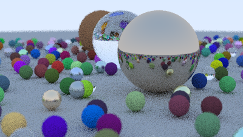

# RayTracingInterop (C# C ABI C++)
<p align="center">
  
</p>

This project renders the “Ray Tracing in One Weekend” image using native C++ code, but runs the render from **C#** using interop.
The C++ renderer is exposed through a **C ABI** (flat `extern "C"` API), and the C# app calls it using **P/Invoke** + **unsafe pointers** + a **native callback** implemented with `delegate*` and `[UnmanagedCallersOnly]`.C# cannot reliably call C++ classes/templates directly.
So the C++ ray tracer is wrapped behind a C-compatible API:

* plain structs (`rt_settings`)
* raw pointers (`uint8_t* out_rgba`)
* function pointer callback (`rt_tile_callback`)

**IMPORTANT NOTE**: This project uses source code of the C++ implementation of Peter Shirley's "Ray Tracing in One Weekend" from this repo `https://github.com/utilForever/ray-tracing-in-one-weekend-cpp`. I do not own any of the implementations that are directly copied/modified from it.

## Overview

* Builds a native shared library (`librtweekend.dylib` on macOS, `librtweekend.so` on Linux and `librtweekend.dll` on Windows) containing the ray tracer.
* Exposes a single exported function:
  * `rt_render(settings*, out_rgba, stride_bytes, callback)`
* The C# program:

  * allocates a `byte[]` RGBA buffer for the image,
  * pins it with `fixed`, so the GC won’t move it,
  * calls the native renderer,
  * writes the result to `output.ppm`.
* During rendering, the native code reports partial progress via a callback after each rendered tile.


## Interop details (unsafe and function pointers)

### `unsafe` and pinned buffer

The renderer writes pixels into an RGBA output buffer:

* C# allocates: `byte[] rgba = new byte[height * stride]`
* C# pins it: `fixed (byte* pOut = rgba) { ... }`
* The pointer `pOut` is passed to C++ as `uint8_t* out_rgba`.

Pinning is needed because the Garbage collector can move managed arrays in memory.

### `delegate*` + `[UnmanagedCallersOnly]` callback

To support **partial/progressive output**, the native renderer calls back after finishing each tile.

* C# passes a native function pointer: `&Native.OnTile`
* `OnTile` is marked with:

  * `[UnmanagedCallersOnly(CallConvs = new[] { typeof(CallConvCdecl) })]`
* The callback signature matches the C function pointer type exactly and uses the same calling convention (`cdecl`).

The callback receives:

* tile position `(x, y)`
* tile size `(w, h)`
* a pointer to the tile’s pixel data inside the full buffer
* `stride_bytes`

In this project the callback prints progress like:

```
Tile (0,0) 32x32
Tile (32,0) 32x32
...
```


## Project layout

```
.
├─ native/
│  ├─ CMakeLists.txt
│  ├─ include/
│  │  └─ rt_capi.h              #C ABI header (extern "C")
│  └─ src/
│     ├─ rt_capi.cpp            #C ABI wrapper+render loop+tile callback
│     └─ book/                  #RTIOW C++ headers(copied from utilForever repo)
│        ├─ camera.h
│        ├─ common.h
│        ├─ ...
│        └─ vec3.h
└─ managed/
   └─ RayTracingInterop/
      ├─ RayTracingInterop.sln
      └─ RayTracingInterop/
         ├─ RayTracingInterop.csproj
         ├─ Native.cs           # DllImport+delegate* + UnmanagedCallersOnly
         └─ Program.cs          # alloc buffer, call rt_render, save output.ppm
```


## Build & Run (macOS / Linux)

### Requirements

* .NET SDK (matching `net9.0`)
* CMake
* A C++ compiler 

### 1) Build native library

From repo root:

```bash
cmake -S native -B native/build -DCMAKE_BUILD_TYPE=Release
cmake --build native/build -j
```

This produces:

* `native/build/librtweekend.dylib` on macOS
* `native/build/librtweekend.so` on Linux

### 2) Build managed app

```bash
dotnet build managed/RayTracingInterop/RayTracingInterop/RayTracingInterop.csproj -c Release
```

### 3) Copy the native library next to the executable

Adjust `netX.Y` to match your build output folder (example: `net9.0`):

```bash
# macOS
cp native/build/librtweekend.dylib managed/RayTracingInterop/RayTracingInterop/bin/Release/net9.0/

# Linux
cp native/build/librtweekend.so managed/RayTracingInterop/RayTracingInterop/bin/Release/net9.0/
```

### 4) Run

```bash
cd managed/RayTracingInterop/RayTracingInterop/bin/Release/net9.0
./RayTracingInterop
```

On macOS, you can open the result with:

```bash
open out.ppm
```

On Linux, use your preferred image viewer, for example:

```bash
xdg-open out.ppm
```

You should see:

* console tile progress
* `out.ppm` a noisy rendered scene


## Third-party code / License

This project uses the C++ RTIOW implementation from:

https://github.com/utilForever/ray-tracing-in-one-weekend-cpp (MIT license)

